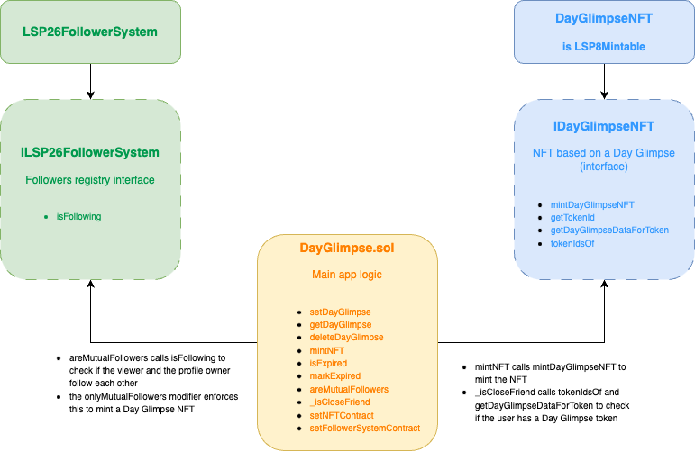
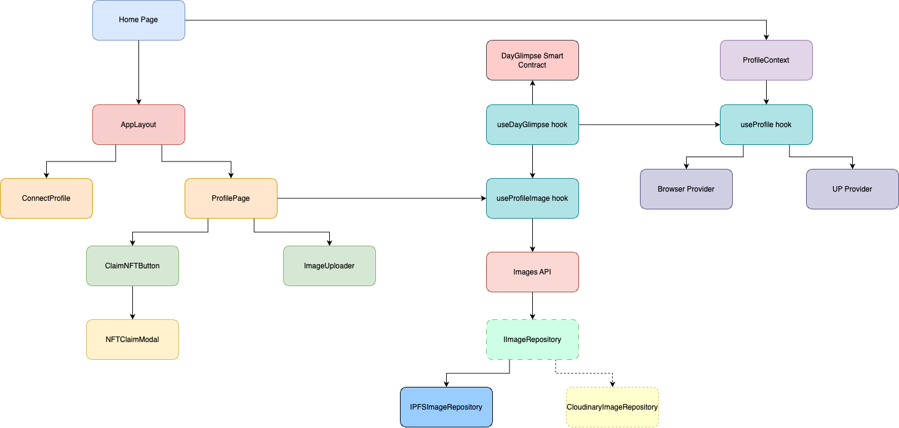

# Day Glimpse: your Universal story

## Overview

Day Glimpse is a mini DApp intended for use within the Universal Everything Grid. It allows users to share moments with their network, much like social media stories. The goal is to enhance the social aspect of The Grid and drive engagement towards the LUKSO ecosystem in a fun, interactive way. For the time being, media types are limited to images/gifs.

Having a Universal Profile is requried to use Day Glimpse.

The user flow is as follows:

- User A uploads an image. There are two visibility options: Public or Exclusive. User A chooses Public, which makes their Day Glimpse visible to anyone with a Universal Profile.
- User B visits User A's profile and sees their Day Glimpse (the image they uploaded) on The Grid.
- Only if User A and User B follow each other, User B will see the option to claim User A's Day Glimpse as an NFT.
- If User B mints the NFT, they become eligible for viewing future Day Glimpses by User A that are set as Exclusive.
- User A's Day Glimpse expires after 24 hours or when User A manually deletes it, whichever happens first.
- User A can then choose to upload a Day Glimpse with the Exclusive visibility option, which will make it viewable only to users that hold at least one of their previous Day Glimpse NFTs.

## Technical Details
### Smart Contracts

The DayGlimpse smart contract handles the main application logic, which involves:
- creating a Day Glimpse
- getting a Day Glimpse for a particular profile address
- deleting a Day Glimpse
- validating expiration date
- triggering the minting of the Day Glimpse NFT
- enforcing Day Glimpse NFT ownership for Exclusive mode (or "close friendship").

The NFT capabilities are handled by the DayGlimpseNFT smart contract.

Day Glimpse leverages two LSPs:

- LSP26: Through the ILSP26FollowerSystem interface, the DayGlimpse smart contract is able to validate and enforce the mutual follower condition. Day Glimpse NFT minting will only occur if the user attempting to claim a Day Glimpse as an NFT follows the Day Glimpse creator and the latter follows them back.
- LSP8: Day Glimpse NFTs are handled by a dedicated contract, DayGlimpseNFT, which extends LSP8Mintable. This automatically inherits all the NFT capabilities already in use within the LUKSO ecosystem and adds specific functionality, like restricting token minting to the original Day Glimpse contract and handling Day Glimpse data as metadata for the NFT before executing the minting.



### Application Architecture

The application is built on Next.js and consists of the components shown in the diagram below.



- **Home Page**: main entry point (page.tsx).
- **ProfileContext**: provides context for UP connection and provides functions to handle blockchain transactions and calls (exposed via the useProfile hook).
- **AppLayout**: handles two main paths, based on whether the UP is connected or not. It will either show the ConnectProfile component or child component (in this case, ProfilePage), depending on this condition.
- **ConnectProfile**: UI component that shows the main screen when the UP is not connected to the app.
- **ProfilePage**: sets up the ImageUploader and ClaimNFT button components.
- **ImageUploader**: handles uploading, viewing and deleting the Day Glimpse image.
- **ClaimNFTButton**: the button that triggers the NFT minting. It also includes checking the mutual followers condition to enable or disable the button, making this condition clear to the user.
- **NFTClaimModal**: the modal that pops up when the ClaimNFT button is clicked.
- **useProfile**: hook that exposes the main ProfileContext functionality. It handles the browser provider and UP provider to get the connected account and its corresponding signer for smart contract interactions, as well as the context profile, i.e., the current profile in the parent page (typically, universaleverything.io). It exposes generic functions to call smart contract functions and send transactions to the blockchain, based on contract address and ABI. It includes the sendAppTransaction, that is meant for transactions to be carried out by an internal wallet associated to the app (logic in the app-transaction API).
- **useDayGlimpse**: hook that provides functions execute the necessary DayGlimpse smart contract functions. It prepares the data, contract address and ABI and uses the functions exposed by useProfile to send the transactions.
- **useProfileImage**: hook that provides functions to handle the Day Glimpse image (upload, get and delete). It uses useDayGlimpse for the smart contract side of the logic and the Images API to interact with an external storage solution.
- **IImageRepository**: an interface that provides function signatures to handle main image operations for external storage.
- **CloudinaryImageRepository** (deprecated): initial implementation of the IImageRepository interface used in early stages of the app, when images were stored in Cloudinary.
- **IPFSImageRepository**: current implementation of IImageRepository, which uses Pinata as pinning service for IPFS storage.


## Running Day Glimpse locally

- Complete .env.local based on .env.template. 

A Pinata account is necessary for this implementation. If preferred, it can be switched to Cloudinary by modifying the src/presentation/dependencies.ts file from:

```Typescript
// const imageRepository = new CloudinaryImageRepository();
const imageRepository = new IPFSImageRepository();
```

to:

```Typescript
const imageRepository = new CloudinaryImageRepository();
// const imageRepository = new IPFSImageRepository();
```

and Cloudinary credentials must be provided instead of Pinata's.

A wallet's private key must be provided to execute transactions that are not user-facing and handled automatically by the app.

- Install dependencies:

```zsh
npm install
```

- Compile smart contracts. This ensures ABIs are available to the application.

```zsh
npm run compile
```

- Run the application in dev:

```zsh
npm run dev
```

## Running smart contract tests

```zsh
npm run test:contracts
```

## Deploying contracts

- First, set up .env.hardhat based on .env.hardhat.template. A wallet private key must be provided to deploy to LUKSO testnet.
- This is not necessary to run the app, but can be useful if wanting to make modifications

```zsh
npm run deploy
```
## Coming up next

This initial version shows the core flow in action and leverages The Grid and LSPs, but there are things to be built on top of it to improve the experience.

- Enhancing the Day Glimpse NFT metadata so that the image is automatically displayed when viewing the collection on universaleverything.io. IPFS storage hash is already included in the metadata, but further tweaking in the NFT minting function could allow automatic display.
- Possibility of "close friend" removal. Give the Day Glimpse creator the option of removing someone from the Exclusive Day Glimpse viewers, or enforce mutual follows to view Exclusive content.
- Possibility of payable Day Glimpse NFTs, generating revenue for the creator and to help maintain the app.
- Supporting short videos, audio and text
- Providing more interaction options: opening a chat, allowing reactions (possible partnership with giftmoji?)
- Working on technical debt and making the application more robust. Extracting a dedicated backend and using a database to improve data tracking within the app, as well as caching mechanisms to improve performance.
  
## Possible User Adoption strategies

For post-launch, there are a few things that can be done for driving adoption and maintaining the app:

### Community Engagement

- Host interactive demos within the Universal Everything Grid community
- Run weekly themed challenges for creative Day Glimpses
- Establish an early adopter program with exclusive NFTs for first 100 active users

### User Growth

- Leverage the mutual follower NFT minting requirement to naturally expand networks
- Create educational content showing how Day Glimpse enhances Universal Profiles
- Partner with other LUKSO projects for cross-promotion
- Add achievement milestones for consistent users

### Long-Term Support

- Expand beyond images/GIFs to include videos and interactive content
- Implement user feedback mechanisms for feature prioritization
- Maintain open-source repository for community contributions
- Commit to monthly updates and performance improvements
- Track usage analytics to optimize user experience
